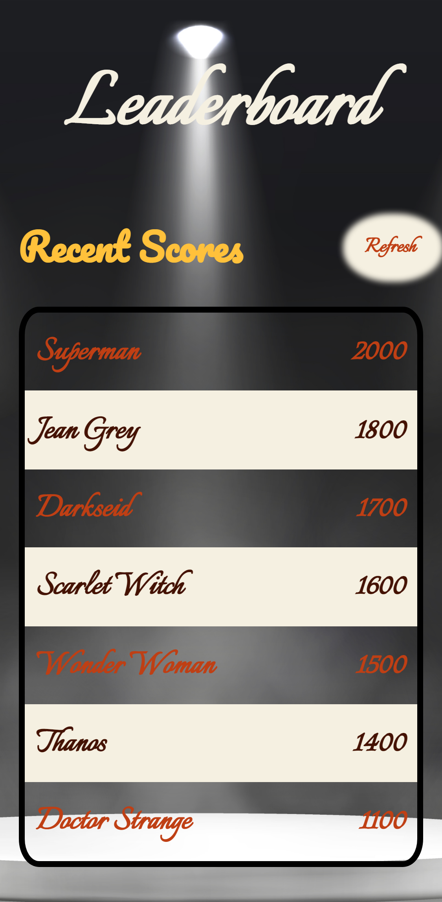

# Leaderboard
> This website creates a working version of the leaderboard that preserves user input. The website is built using medium wireframe

> |Mobile Version|Desktop Version
> |--------------|--------------|
> |.|| 

## Built With

- HTML, CSS, JavaScript
- Webpack
- Git, Github
  

## Prerequisites
Basic understanding of HTML, JavaScript, CSS Git and GitHub

[Live Demo Link](https://benmukebo.github.io/Awesome-Books/)

## Getting Started

### To get a local copy up and running follow these simple example steps below:

1. Copy this website **``https://github.com/Gambit142/Leaderboard``**
2. Navigate to the location of the folder in your machine you wish to save this folder:
**``you@your-Pc-name:~$ cd <folder>``**
3. Clone this repository or download the Zip folder:
**``git clone https://github.com/Gambit142/Leaderboard.git``**
4. Change Directory into the cloned repository: **``you@your-Pc-name:~$ cd <Gambit142>``**
5. Open the repository with Visual Code Editor: **``you@your-Pc-name:~$ code .``** or open with any code editor of your choice.

## Authors

👤 **Francis Nzenwa Ugorji**

- GitHub: [@Gambit142](https://github.com/Gambit142)
  
- LinkedIn: [Francis Ugorji](www.linkedin.com/in/francis-ugorji-a567b7168)

## 🤝 Contributing

Contributions, issues, and feature requests are welcome!

Feel free to check the [issues page](../../issues/).

## Show your support

Give a ⭐️ if you like this project!

## Acknowledgments

- **``Microverse``** for the opportunity to underatake such project using their platform
- To family and friends who motivated us throughout this project
- [Leaderboard API service](https://www.notion.so/Leaderboard-API-service-24c0c3c116974ac49488d4eb0267ade3) for granting me permission to fetch data from their site.

## 📝 License

This project is [MIT](./MIT.md) |licensed.
